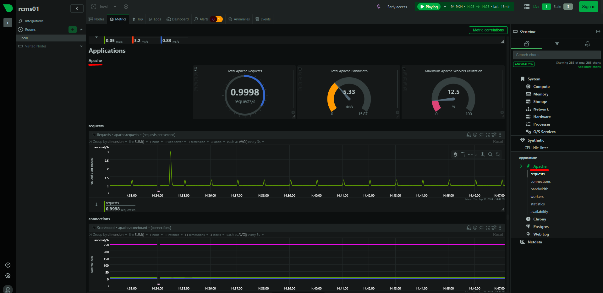

## Monitor Apache HTTP Server:
To monitor Apache HTTP Server (httpd) with Netdata, follow these steps. Netdata can collect performance metrics from Apache, such as requests per second, response times, connections, and more, providing real-time insights.


### Enable Mod_Status Module in Apache:
Netdata uses the `mod_status` module of Apache to collect metrics. You need to enable and configure this module if it’s not already enabled.

_Ensure the following line is uncommented to load the `mod_status` module:_

```
cat /etc/httpd/conf.modules.d/00-base.conf | grep mod_status

  LoadModule status_module modules/mod_status.so
```


_Add or modify the following configuration to enable the server-status page:_

```
vim /etc/httpd/conf.d/server-status.conf


<Location "/server-status">
    SetHandler server-status

    #Require host localhost
    #Require host example.com
    #Require ip 192.168.1.0/24
	
</Location>
```


```
systemctl restart httpd
```


### verify that the Apache server status:

```
yum install lynx
```


```
lynx http://localhost/server-status

lynx http://192.168.10.192/server-status/
```


_Check from web browser:_
```
http://192.168.10.192/server-status/

http://192.168.10.192/server-status?auto
```


## Configure Netdata to Monitor Apache: 

### 1. Go-based Apache monitoring module:

Netdata has a built-in plugin to monitor Apache, but you need to configure it. The `/etc/netdata/go.d/apache.conf` file is used to configure Netdata's **Go-based Apache monitoring module** (as part of the go.d plugins). 


```
vim /etc/netdata/go.d/apache.conf

jobs:
  - name: local
    #url: http://localhost/server-status?auto
    url: 'http://192.168.10.192/server-status?auto'
```


_If Multiple Apache Servers:_

```
jobs:
  - name: local
    url: http://localhost/server-status?auto

  - name: remote_apache
    url: http://10.0.0.20/server-status?auto
```


_Test the Configuration:_

```
ll /usr/libexec/netdata/plugins.d/go.d.plugin

-rwxr-x--- 1 root netdata 84295832 Sep 10 18:59 /usr/libexec/netdata/plugins.d/go.d.plugin
```


```
/usr/libexec/netdata/plugins.d/go.d.plugin -d -m apache
```


```
systemctl restart netdata 
```


### 2. Python-based Apache monitoring plugin:

The `/etc/netdata/python.d/apache.conf` file is used to configure **Netdata’s Python-based Apache monitoring** plugin. This plugin gathers metrics from an Apache HTTP Server (httpd) using the `mod_status` page, similar to the Go plugin but written in Python.


The Netdata Apache Python plugin configuration is stored in `/etc/netdata/python.d/apache.conf`. If it doesn't exist, you can create it:

```
vim /etc/netdata/python.d/apache.conf

local:
  name: 'local'
  #url: 'http://localhost/server-status?auto'
  url: 'http://192.168.10.192/server-status?auto'
```


_Monitor Multiple Apache Servers:_

```
local_apache:
  name: 'local_apache'
  url: 'http://localhost/server-status?auto'

remote_apache_1:
  name: 'remote_apache_1'
  url: 'http://10.0.0.1/server-status?auto'

remote_apache_2:
  name: 'remote_apache_2'
  url: 'http://10.0.0.2/server-status?auto'
```


_Test the Apache Plugin:_
```
ll /usr/libexec/netdata/plugins.d/python.d.plugin

-rwxr-x--- 1 root netdata 28085 Sep 10 18:57 /usr/libexec/netdata/plugins.d/python.d.plugin
```


```
/usr/libexec/netdata/plugins.d/python.d.plugin apache debug
```


```
systemctl restart netdata
```


### Verify:


```
http://192.168.10.191:19999
```




### Links:

- [Apache Module mod_status](https://httpd.apache.org/docs/2.4/mod/mod_status.html)
- [Monitoring Apache with Netdata](https://www.netdata.cloud/apache-monitoring/)
- [Monitor Apache Performance using Netdata](https://www.tecmint.com/monitor-apache-performance-using-netdata-on-centos/)
- [Netdata via Apache's mod_proxy](https://learn.netdata.cloud/docs/netdata-agent/configuration/running-the-netdata-agent-behind-a-reverse-proxy/apache)


