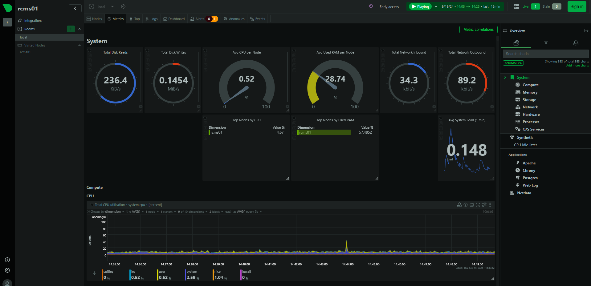

## Netdata Install on Rocky:

Netdata is committed to open-source. The core of the Netdata ecosystem is the open-source Netdata Agent. All the monitoring features Netdata offers are baked into it. The database, the query engine, the scoring engine, the health engine, the machine learning engine, and many more are all open-source, released under GPL3+. Netdata is our gift to the world!

Netdata is a real-time performance monitoring tool that provides insights into the health and performance of systems and applications. It's designed to be lightweight, open-source, and highly customizable, offering detailed metrics with minimal resource consumption.


### What does kickstart.sh do?
The kickstart.sh script does the following after being downloaded and run using sh:

- Determines what platform you are running on.
- Checks for an existing installation, and if found updates that instead of creating a new install.
- Attempts to install Netdata using our official native binary packages.
- If there are no official native binary packages for your system (or installing that way failed), tries to install using a static build of Netdata if one is available.
- If no static build is available, installs required dependencies and then attempts to install by building Netdata locally (by downloading the sources and building them directly).
- Installs netdata-updater.sh to cron.daily, so your Netdata installation will be updated with new nightly versions, unless you override that with an optional parameter.
- Prints a message whether installation succeeded or failed for QA purposes.


### Install Netdata: 

```
cat /etc/os-release
```


_Install Dependencies:_
```
yum install epel-release -y

yum install git libuuid-devel autoconf automake pkgconfig zlib-devel curl findutils libmnl libmnl-devel gcc gcc-c++ make lm_sensors-devel -y
```


_Install Netdata via `kickstart.sh`:_

```
bash <(curl -Ss https://my-netdata.io/kickstart.sh)

or,


wget https://my-netdata.io/kickstart.sh

bash kickstart.sh
```


Or,

```
wget -O /tmp/netdata-kickstart.sh https://get.netdata.cloud/kickstart.sh && sh /tmp/netdata-kickstart.sh

wget -O /tmp/netdata-kickstart.sh https://get.netdata.cloud/kickstart.sh && sh /tmp/netdata-kickstart.sh --no-updates

wget -O /tmp/netdata-kickstart.sh https://get.netdata.cloud/kickstart.sh && sh /tmp/netdata-kickstart.sh --no-updates --stable-channel

wget -O /tmp/netdata-kickstart.sh https://get.netdata.cloud/kickstart.sh && sh /tmp/netdata-kickstart.sh --no-updates --stable-channel --claim-token YOUR_CLAIM_TOKEN
```


```
//env dnf makecache
//env dnf install epel-release
//env dnf install netdata 
```


```
### Output:

Successfully installed the Netdata Agent.

To view your system's real-time performance metrics, open your web browser and enter http://NODE:19999.

Replace NODE with the IP address or hostname of your Netdata server to access the dashboard.
```


```
systemctl start netdata
systemctl status netdata
systemctl restart netdata

systemctl enable netdata
```


```
wget -O /tmp/netdata-kickstart.sh https://get.netdata.cloud/kickstart.sh && sh /tmp/netdata-kickstart.sh --uninstall
```


### Web Console:
```
http://192.168.10.191:19999
```


```
http://192.168.10.191:19999/netdata.conf
```





### Links:

- [Install Netdata](https://learn.netdata.cloud/docs/netdata-agent/installation/linux/)
- [Install Netdata from a Git](https://learn.netdata.cloud/docs/developer-and-contributor-corner/install-the-netdata-agent-from-a-git-checkout/)
- [Monitor anything with Netdata](https://learn.netdata.cloud/docs/collecting-metrics/monitor-anything)
- [Github | netdata](https://github.com/netdata/netdata)
- [Github | netdata releases](https://github.com/netdata/netdata/releases)
- [Monitor services using Netdata](https://www.howtoforge.com/how-to-install-and-monitor-services-using-netdata-monitoring-tool-on-rocky-linux-8/)


